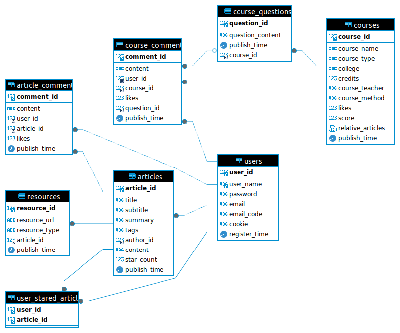

# share_web

## share_web
### 组成
#### 用户管理  
- 用户的个人信息
- 用户的最近浏览历史
- 用户的收藏列表
- ... ...
#### 课程话题  
- 课程
  - 课程名称
  - 授课老师
  - 其他信息
- 课程评论列表
  - 或者直接列出需要标注的项(如是否有签到，是否有作业，期末考试形式)
- 课程相关资源(根据相关性推荐资源博客)  
#### 资源博客  
- 资源博客名称  
  - 资源博客信息
  - 资源博客标签
- 资源评论列表  
### 功能
#### 用户个人
- 修改个人信息
- 发布，修改，删除个人博客资源  
- 关注某个用户?
#### 搜索
- 可通过搜索直接搜索到**课程话题**或者**资源博客**  

### 数据库创建
- 设计  

- share_web
#### 用户表 (`users`)
- `user_id`: 用户的唯一标识符，自增的整数，作为主键。
- `user_name`: 用户名，一个不超过20个字符的字符串，不允许重复。
- `password`: 用户的密码，存储为16个字符的字符串（实际应用中，密码应加密存储，而非明文）。
- `email`: 用户的电子邮箱地址，最长可达255个字符。
- `email_code`: 用于邮箱验证的验证码，通常为6位数字或字母组合。
- `cookie`: 用户的会话标识，用于网站识别用户，最大长度255个字符。
- `stared_articles`: 用户收藏的文章列表，以JSON格式存储，可以是一个包含文章ID的数组。
- `published_articles`: 用户发布过的文章列表，同样以JSON格式存储。
- `UNIQUE (user_name)`: 确保用户名的唯一性。
- `register_time`: 用户注册的时间戳，默认为当前时间。
```mysql
CREATE TABLE users (
    user_id INT AUTO_INCREMENT PRIMARY KEY,
    user_name VARCHAR(20) NOT NULL,
    password VARCHAR(16) NOT NULL,
    email VARCHAR(255),
    email_code VARCHAR(6),
    cookie VARCHAR(255),
    register_time TIMESTAMP DEFAULT CURRENT_TIMESTAMP,
    UNIQUE (user_name)
);
```
#### 收藏文章表  
```mysql
CREATE TABLE user_stared_articles (
    user_id INT NOT NULL,
    article_id INT NOT NULL,
    PRIMARY KEY (user_id, article_id),
    FOREIGN KEY (user_id) REFERENCES users(user_id)
        ON DELETE CASCADE,
    FOREIGN KEY (article_id) REFERENCES articles(article_id)
        ON DELETE CASCADE
);
```
#### 文章表 (`articles`)
- `article_id`: 文章的唯一标识符，自增的整数，作为主键。
- `title`: 文章标题，最长可达240个字符，适合支持中文标题。
- `subtitle`: 文章副标题，同样支持长达240个字符。
- `summary`: 文章摘要，使用TEXT类型存储，可以存放大量文本。
- `tags`: 文章的标签，使用TINYTEXT类型，可以存储较短的文本串，多个标签间用逗号分隔。
- `author_id`: 文章作者的用户ID，与`users`表形成外键关系。
- `content`: 文章正文，使用TEXT类型存储。
- `star_count`: 文章获得的星级评分次数，初始值为0。
- `published_time`:文章的发表时间
- `FOREIGN KEY (author_id) REFERENCES users(user_id)`: 确保`author_id`在`users`表中有对应的`user_id`。
```mysql
CREATE TABLE articles (
    article_id INT AUTO_INCREMENT PRIMARY KEY,
    title VARCHAR(240) NOT NULL,
    subtitle VARCHAR(240),
    summary TEXT,
    tags TINYTEXT,
    author_id INT NOT NULL,
    content TEXT NOT NULL,
    star_count INT DEFAULT 0,
    publish_time TIMESTAMP DEFAULT CURRENT_TIMESTAMP,
    FOREIGN KEY (author_id) REFERENCES users(user_id)
);
```
#### 评论表 (`article_comments`)
- `comment_id`: 评论的唯一标识符，自增的整数，作为主键。
- `content`: 评论内容，使用TINYTEXT类型存储，限制在较小的文本长度内。
- `user_id`: 发表评论的用户的ID，与`users`表形成外键关系。
- `article_id`: 被评论的文章的ID，与`articles`表形成外键关系。
- `likes`: 评论获得的点赞数，初始值为0。
```mysql
CREATE TABLE article_comments (
    comment_id INT AUTO_INCREMENT PRIMARY KEY,
    content TINYTEXT NOT NULL,
    user_id INT NOT NULL,
    article_id INT NOT NULL,
    likes INT DEFAULT 0,
    publish_time TIMESTAMP DEFAULT CURRENT_TIMESTAMP,
    FOREIGN KEY (user_id) REFERENCES users(user_id),
    FOREIGN KEY (article_id) REFERENCES articles(article_id)
);
```
#### 资源表 (`resources`)
- `resource_id`: 资源的唯一标识符，自增的整数，作为主键。
- `resource_url`: 资源的URL地址，最长可达255个字符。
- `resource_type`: 资源的类型，使用枚举类型限制为特定的几种常见文件类型。
- `article_id`: 关联的文章ID，与`articles`表形成外键关系。
```mysql
CREATE TABLE resources (
    resource_id INT AUTO_INCREMENT PRIMARY KEY,
    resource_url VARCHAR(255) NOT NULL,
    resource_type ENUM('pdf', 'zip', 'other') NOT NULL,
    article_id INT NOT NULL,
    publish_time TIMESTAMP DEFAULT CURRENT_TIMESTAMP,
    FOREIGN KEY (article_id) REFERENCES articles(article_id)
);
```
#### 课程表 (`courses`)
- `course_id`: 课程的唯一标识符，自增的整数，作为主键。
- `course_name`: 课程名称，最长可达255个字符。
- `course_type`: 课程类型，如专业课、选修课等，最长20个字符。
- `college`: 开设课程的学院或系，最长50个字符。
- `credits`: 课程学分，一个整数。
- `course_teacher`: 授课教师姓名，最长100个字符。
- `course_method`: 教学方法，如线上教学、线下授课等，最长100个字符。
- `likes`: 课程获得的点赞数，初始值为0。
- `score`: 课程评价分数，使用DECIMAL类型，最多三位数字，一位小数。
- `relative_questions`: 与课程相关的问答列表，以JSON格式存储。
- `relative_articles`: 与课程相关的文章列表，同样以JSON格式存储。
```mysql
CREATE TABLE courses (
    course_id INT AUTO_INCREMENT PRIMARY KEY,
    course_name VARCHAR(255),
    course_type VARCHAR(20),
    college VARCHAR(50),
    credits INT DEFAULT 0,
    course_teacher VARCHAR(100),
    course_method VARCHAR(100),
    likes INT DEFAULT 0,
    score DECIMAL(3, 1),
    relative_articles JSON,
    publish_time TIMESTAMP DEFAULT CURRENT_TIMESTAMP,
);
```
#### 课程评论表 (`course_comments`)
- `comment_id`: 评论的唯一标识符，自增的整数，作为主键。
- `content`: 评论内容，使用TINYTEXT类型存储。
- `user_id`: 发表评论的用户的ID，与`users`表形成外键关系。
- `course_id`: 被评论的课程的ID，与`courses`表形成外键关系。
- `likes`: 评论获得的点赞数，初始值为0。
```mysql
CREATE TABLE course_comments (
    comment_id INT AUTO_INCREMENT PRIMARY KEY,
    content TINYTEXT NOT NULL,
    user_id INT NOT NULL,
    course_id INT NOT NULL,
    likes INT DEFAULT 0,
    question_id INT,
    publish_time TIMESTAMP DEFAULT CURRENT_TIMESTAMP,
    FOREIGN KEY (user_id) REFERENCES users(user_id),
    FOREIGN KEY (course_id) REFERENCES courses(course_id),
    FOREIGN KEY (question_id) REFERENCES course_questions(question_id)
);
```
#### 课程问题表(`course_questions`)
- `question_id`: 问题唯一的标识符  
- `question_content`: 问题内容  
- `publish_time`: 发布时间  
- `course_id`: 相关的课程id
CREATE TABLE course_questions (
    question_id INT AUTO_INCREMENT PRIMARY KEY,
    question_content TINYTEXT NOT NULL,
    publish_time TIMESTAMP DEFAULT CURRENT_TIMESTAMP,
    course_id INT NOT NULL,
    FOREIGN KEY (course_id) REFERENCES courses
    (course_id)
);


### 添加makrdown文本配置
```shell
npm install maked
npm install --save-dev @babel/plugin-transform-private-methods
```

### 添加Vuex配置  
```shell
npm install vuex --save
```
### 添加图标配置  
```shell
npm install @mdi/js @jamescoyle/vue-icon @mdi/light-js
```